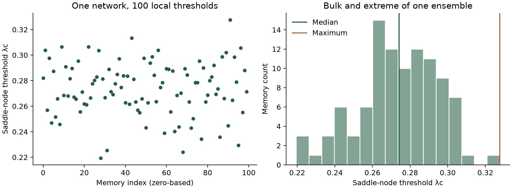
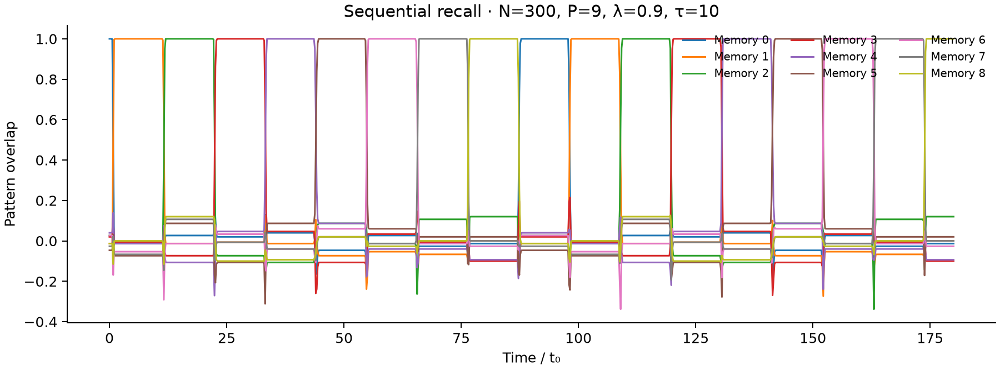

# Hopfield dynamics
### From a distribution of local bifurcations to sequential memory recall

[Research overview](https://leo-flack.leo-flack01.chatgpt.site/research/hopfield) · [Working manuscript](https://leo-flack.leo-flack01.chatgpt.site/documents/hopfield-draft.pdf) · [Internship report](https://leo-flack.leo-flack01.chatgpt.site/documents/hopfield-report.pdf) · [Methods & evidence](docs/CLAIMS.md)

**Leo Flack · University of Chicago, James Franck Institute · 2026**

Research internship supervised by **Vincenzo Vitelli**. Manuscript in preparation.

A Hopfield network stores memories as stable states. Add a delayed, non-reciprocal interaction, and it can replay those memories in order. **What sets the transition from a pinned memory to a moving sequence?**

This project resolves that question one memory at a time. In the finite networks studied here, each memory-connected branch ends at its own saddle-node threshold. The bulk of their distribution marks the loss of extensive static recall; its maximum predicts the onset of ordered replay.



*Replotted directly from shipped data by the quick-start script. No synthetic or fitted replacement data.*

## Start here

| If you have… | Read or run |
|---|---|
| 2 minutes | This overview and the two figures |
| 10 minutes | [Quick start](#quick-start), then [numerical methods](docs/NUMERICAL_METHODS.md) |
| A scientific question | [Claim-by-claim evidence](docs/CLAIMS.md) and [limitations](docs/OPEN_ITEMS.md) |
| A reproducibility question | [Verified entry points](docs/VERIFIED_ENTRY_POINTS.md), then the [historical runbook](docs/REPRODUCING.md) |

## What I worked on

- An **exact reduction from N neuron coordinates to P pattern coordinates**, retaining the disorder of the sample rather than averaging it away.
- **Fixed-point continuation** and memory-resolved saddle-node thresholds.
- **Delay-differential integration** using a method of steps with RK4 and Hermite interpolation.
- **Spectral, Floquet and Lyapunov analyses** to distinguish pinned states, periodic recall and irregular dynamics.
- **Finite-size statistics and extreme-value comparisons**, with independent static and dynamic numerical checks.
- **Controlled model variations**: short delays, correlated patterns and a multilayer architecture with implicit delay.

The existing research archive is preserved in this repository, including its evidence register and historical campaigns. The tested entry points below are a small, portable way into that larger body of work.

## Quick start

Requires **Python 3.10+**. Tested locally with Python 3.12; no GPU is required.

```bash
git clone https://github.com/leoF333/hopfield-dynamics.git
cd hopfield-dynamics
python -m venv .venv
source .venv/bin/activate           # Windows: .venv\Scripts\activate
python -m pip install -r requirements.txt

python examples/quickstart.py
python -m unittest discover -s tests -v
```

The example writes to `outputs/quickstart/`:
1. `thresholds.png`: the archived 100-memory threshold ensemble;
2. `sequential-recall.png`: a new small-network simulation;
3. `recall.npz` and `summary.json`: the simulated overlaps, parameters and numerical summary.

Use `--data-only` to skip the simulation, or `--output /your/output/folder` to choose a destination. The small demo uses N=300 and P=9; **it illustrates the dynamics and does not certify the manuscript's N=2000 reference results**.



## Numerical checks

The six fast regression tests check:

- the reduced right-hand side against independently constructed dense Hebbian matrices;
- the analytical overlap Jacobian against finite differences;
- agreement of full and reduced trajectories across a delay interval;
- checkpoint/restart consistency, including history derivatives;
- time-step refinement;
- the archived threshold data against reported reference values.

These tests do not certify every historical campaign or establish the scientific claims as theorems. See [the validation record](docs/VERIFIED_ENTRY_POINTS.md).

## Repository map

```text
examples/            Runnable introduction
tests/               Fast numerical regression tests
code/core/           Reduced model, continuation, spectra and integrators
code/experiments/    Historical E-series experiments
code/campaigns/      Independent N-series verification campaigns
code/figures/        Research figure generation and assembly
data/                Derived research data and campaign reports
figures/             Manuscript figures and quick-start outputs
docs/                Methods, evidence, provenance and open questions
tools/               Integrity and archive utilities
```

## Scope of the conclusions

The threshold law is measured, not analytically derived. Its approximate Gaussian form and size dependence hold over the tested regimes. The global invariant-circle construction concerns the terminal and penultimate stages of the reference realization. Chaos and stationarity are finite-time numerical observations. The multilayer model establishes an implicit recall clock, not a full equivalence of bifurcation mechanisms.

The [open-items register](docs/OPEN_ITEMS.md) retains discrepancies and figure-provenance issues identified during research. Some historical scripts still depend on the original archive layout; the [verified entry points](docs/VERIFIED_ENTRY_POINTS.md) state precisely what runs from this checkout.

## Citation & licensing

The accompanying manuscript is **in preparation**, not peer-reviewed. Citation metadata are in [CITATION.cff](CITATION.cff); no paper DOI is claimed.

Code: [MIT](LICENSE). Research data and figures: [CC BY 4.0](LICENSE-DATA). Please retain attribution and consult the reports for scientific context.

[Personal site](https://leo-flack.leo-flack01.chatgpt.site) · [GitHub profile](https://github.com/leoF333)
