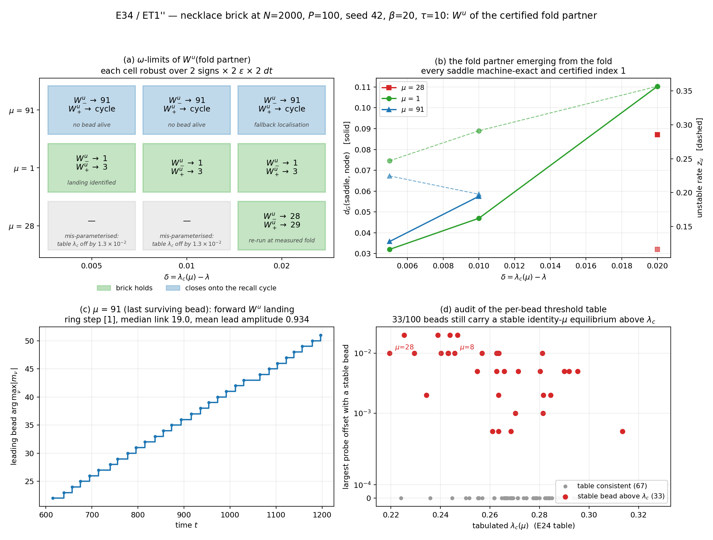

# E34 — ET1″ : test direct du maillon du collier à N=2000

**Date :** 27 juillet 2026
**Paramètres :** `N=2000`, `P=100` (`α=0.05`), `β=20`, `τ=10`, `t0=1`, seed `42`
**Portée :** liaisons sentinelles `μ ∈ {28, 1, 91}`, `δ ∈ {0.005, 0.010, 0.020}`
en dessous du seuil de la perle. Toute la dynamique passe par la réduction
exacte `ReducedDDE` (P=100).
**Statut :** ET1′ a été **re-cadré en ET1″** en cours d'exécution ; la raison
est mesurée et documentée en §1.

## Verdict (vocabulaire R2.1)

1. **Positif — le maillon du collier tient partout où une perle suivante
   existe : 4 cellules sur 4.** Pour `μ=28` (δ=0.020) et `μ=1` (δ=0.005, 0.010,
   0.020), la selle partenaire du fold est exacte machine et certifiée
   d'indice 1, sa branche `W^u₋` retombe sur `node_μ` et sa branche `W^u₊`
   atteint la première perle vivante en avant sur l'anneau. Chaque cellule est
   robuste sur 2 signes × 2 `ε` × 2 `dt` (8 tirs concordants).
2. **Positif — à la dernière perle, le maillon se referme sur le cycle de
   rappel : 3 cellules sur 3.** Pour `μ=91` (`λ_c(91)=0.327629`, soit
   essentiellement `λ*`), aucune autre perle ne survit ; `W^u₋ → node_91` et
   `W^u₊` rejoint une **orbite voyageuse à pas d'anneau exactement +1**
   (durée de maillon médiane 19.0, cv 0.176, période de tour ≈ 1900,
   amplitude moyenne du meneur 0.934). C'est la fermeture SNIC du collier, non
   un échec.
3. **Numériquement indéterminé — l'edge-tracking nœud–nœud ne localise pas
   l'objet de bord à N=2000.** Newton (simple et déflaté) stagne au résidu
   ~10⁻³ depuis 6 amorces réparties sur le plateau de stagnation. Nous
   n'établissons **pas** que l'objet de bord n'est pas un équilibre : nous
   établissons que le budget d'intégration employé ne fournit pas d'amorce
   convergente. Le test du collier a donc été mené par une voie indépendante
   (§2).
4. **Constat d'audit — la table de seuils par perle est en avance pour au
   moins 33 perles sur 100.** Une perle portant encore un équilibre stable
   d'identité `μ` au-dessus de son `λ_c` tabulé est écartée du recensement, ce
   qui transforme un atterrissage légitime en « non adjacent ». C'est la cause
   unique des deux verdicts négatifs initiaux et des trois échecs de `μ=28`.

Ce que ces résultats **n'établissent pas** : que la selle testée soit l'objet
qui sépare effectivement les deux bassins. La connexion `W^u(selle) → node_μ` et
`→ node_suivant` est mesurée ; l'identification de cette selle avec l'objet de
bord reste ouverte (§4.1).

---

## 1. Pourquoi ET1′ a été re-cadré en ET1″

Le design initial localisait la selle par edge-tracking entre `node_μ` et
`node_{μ+1}`, puis la polissait par Newton. Trois mesures ont invalidé cette
voie à N=2000 (`μ=0`, `δ=0.020`, `λ=0.262`).

| Mesure | Fichier | Résultat |
|---|---|---|
| Nature de la frontière | `E34_ET1prime_boundary_diag` | **13/13** échantillons du côté lointain retombent sur `node_1`, tous stationnaires → frontière nœud \| nœud propre, **pas de mer chaotique** |
| Newton depuis l'amorce raffinée | `E34_deflation_test_*.json` | simple : res `5.78e-15`, `n_unst=0`, `d_G(node)=0.0000` → **c'est le nœud** ; déflaté : res `1.07e-01`, diverge |
| Profil de la trajectoire | `e34_dwell_profile.py` | approche la plus proche de la selle arclength `d_G=0.0706` à `t=101.9` ; point de vitesse minimale globale `t=199.7`, vitesse `4.7e-13`, `d_G(node)=0.0000` |
| Newton depuis 6 amorces du plateau | `E34_dwell_seed_test_*.json` | **les 6 stagnent** à res `4e-4 … 2e-3` ; « no certified index-1 object recovered » |

La règle « point le plus lent » capte donc l'**installation finale sur le
nœud** (vitesse 5e−13) et non la stagnation près de la selle ; la règle « dernier
maximum local » échoue de même (elle sélectionne la queue d'installation). Le
défaut était dans l'**amorce**, pas dans le polissage — d'où l'inutilité de la
déflation, qui était le correctif initialement envisagé.

En revanche la selle partenaire du fold s'obtient proprement par
pseudo-arclength, à résidu `1e-15` … `2e-13`. Le collier étant *par définition*
un énoncé sur la variété instable de cette selle, ET1″ le teste directement.

## 2. Protocole effectif (ET1″)

Par cellule `(μ, δ)`, à `λ = λ_c(μ) − δ` :

1. `node_μ` par Newton–Woodbury ; recensement des perles vivantes.
2. **Selle partenaire du fold** par pseudo-arclength à travers le fold
   (indépendante de toute dynamique).
3. **Certification d'indice** par principe de l'argument, avec escalade du
   contour `(samples_per_edge, max_refinements)` sur `(16,7) → (32,9) → (48,11)`
   jusqu'à stabilité du comptage, plus les recoupements `eigmax_M > 0` et
   racine réelle la plus à droite.
4. **Mode instable** = mode nul **variationnel** (`S·Dm`) — jamais le mode
   `T_P`, qui donne ~3 % d'erreur de taux (subtilité V0 du worklog).
5. **Tir des deux branches de `W^u`** avec historique exponentiel, 2 signes
   × `ε ∈ {1e-4, 1e-3}` × `dt ∈ {0.01, 0.005}`, `t_max = 1200`, puis
   classification de l'ω-limite. Une cellule n'est déclarée que si les 4 tirs
   d'une même branche concordent.

**Cible du maillon** : la première perle **vivante** en avant sur l'anneau
(roadmap E34 §5) — les perles meurent une à une, `μ+1` peut être déjà morte.

### 2.1 Résolution de contour requise à P=100

Les réglages du pilote P=20 ne suffisent pas. Mesure d'escalade
(`E34_certif_tune_*.json`) sur les selles `μ=1` et `μ=91` :

| `samples_per_edge` | `max_refinements` | comptage |
|---:|---:|---|
| 16 | 7 | non stabilisé |
| **32** | **9** | **1, stable sous raffinement du contour** |

À `(16,7)` le comptage renvoyait `n_unstable = −1` avec débordements dans
`slogdet`, alors même que l'objet était manifestement instable
(`eigmax_M > 0`, racine réelle positive). C'est une limite de résolution du
contour, pas une indétermination de l'objet.

## 3. Résultats cellule par cellule

Tous les tirs d'une même branche concordent (4/4, ou 2/2 pour la cellule de
repli `μ=91, δ=0.020`).

| μ | δ | λ | selle : résidu | `z_u` | `eigmax` | `d_G`(selle,nœud) | porte linéaire | `W^u₋` | `W^u₊` | statut |
|---:|---:|---:|---:|---:|---:|---:|---:|---|---|---|
| 28 | 0.020 | 0.212122 | 1.5e-15 | 0.11639 | +0.1179 | 0.0871 | 2.5e-3 | → 28 | **→ 29** | maillon positif |
| 1 | 0.005 | 0.298819 | 1.1e-15 | 0.24695 | +0.2412 | 0.0320 | 4.9e-4 | → 1 | **→ 3** | maillon positif |
| 1 | 0.010 | 0.293819 | 5.4e-16 | 0.29120 | +0.3205 | 0.0470 | 5.7e-3 | → 1 | **→ 3** | maillon positif |
| 1 | 0.020 | 0.283819 | 6.3e-15 | 0.35670 | +0.3941 | 0.1103 | 6.3e-3 | → 1 | **→ 3** | maillon positif |
| 91 | 0.005 | 0.322629 | 2.7e-15 | 0.22463 | +0.2490 | 0.0358 | 1.9e-3 | → 91 | cycle | fermeture |
| 91 | 0.010 | 0.317629 | 2.0e-13 | 0.19769 | +0.2207 | 0.0575 | 3.7e-3 | → 91 | cycle | fermeture |
| 91 | 0.020 | 0.307629 | 2.2e-16 | 0.25905\* | +0.3602 | 0.0840 | 7.5e-3 | → 91 | cycle | fermeture |

\* localisation de repli, §4.3.

**Cellule `μ=28`, δ=0.020 :** la perle suivante est la perle **29**, c'est-à-dire
le successeur littéral `μ+1` — les 100 perles sont vivantes à `λ=0.2121`. C'est
le seul cas où le maillon adjacent au sens strict est testable, et il tient.

**Cellules `μ=1` :** les perles 2 et 3 sont mortes selon la table, mais la
perle 2 l'est réellement (`λ_c(2)=0.256889`, très en dessous) tandis que la
perle 3 ne l'est pas. La cible est donc bien la **première perle vivante en
avant**, et les trois cellules donnent le **même** maillon `1 → 3`.

**Cellules `μ=91` :** `n_alive = 1` (δ=0.005, 0.010) puis 2 (δ=0.020). Il n'y a
plus de perle à atteindre ; `W^u₊` reste non stationnaire à `t=1200` et loin de
toute perle. L'identification directe (§4.2) montre une orbite voyageuse
régulière : c'est le cycle de rappel.

## 4. Les trois diagnostics de levée

Trois cellules sur neuf étaient non concluantes à la sortie de la grille.
Chacune a été levée par un diagnostic dédié, et **aucune ne l'a été par un
ajustement de critère**.

### 4.1 `μ=1, δ=0.005` — l'atterrissage « hors recensement »

`W^u₊` se stabilisait sur un point fixe absent du recensement (code `ω = −4`).
Identification directe de l'objet limite :

| Quantité | Valeur |
|---|---:|
| résidu de l'état limite | `3.96e-11` |
| recouvrement dominant | `m₃ = +0.9862` |
| identité de branche (perle 3) | vraie |
| `eigmax_M` | `−0.1569` (stable) |
| `λ_c(3)` tabulé | 0.297529 |
| `λ` de la cellule | 0.298819 |

L'atterrissage **est** la perle 3, stable, à `λ` **au-dessus** de son seuil
tabulé de `1.29e-3`. Le recensement l'avait écartée. Verdict corrigé : maillon
positif, cible 3 — identique aux deux autres cellules `μ=1`.

À noter : à ce `λ`, Newton amorcé sur le motif **échoue** pour la perle 3
(résidu `7.5e-4`) alors que le flot y converge. La détection par Newton depuis
le motif sous-estime donc l'ensemble des perles vivantes (cf. §5).

### 4.2 `μ=91` — la nature de l'atterrissage non stationnaire

Enregistrement de la perle meneuse `arg max |m_ν|` le long de la trajectoire :

| Quantité | Valeur |
|---|---:|
| stationnaire à `t=1200` | non |
| changements de meneur après `t=601` | 30 |
| pas d'anneau observés | **{+1}** (uniforme) |
| durée de maillon médiane | 19.0 (cv 0.176) |
| période de tour complet estimée | ≈ 1900 |
| amplitude moyenne du meneur | 0.934 (min 0.500) |

Une orbite qui avance d'exactement une perle par maillon, à amplitude de
meneur élevée : c'est le régime de rappel. La branche avant de la dernière
perle vivante alimente le cycle — la fermeture attendue du scénario SNIC.

### 4.3 `μ=91, δ=0.020` — localisation de repli

Le comptage était stable à 1 et `eigmax_M = +0.3602 > 0`, mais le raffinement
du rectangle n'isolait pas la racine (`localize_ok = False`, `z_u = NaN`).
Puisque le comptage vaut 1 et qu'une racine **réelle** encadrée existe
(`0.259046`), l'unique racine instable est cette racine réelle. Mode
variationnel construit en ce point : résidu `7.5e-16`, erreur de réalification
`1.2e-16`, **porte linéaire `7.47e-3`**. Les tirs redonnent `W^u₋ → 91` et
`W^u₊ →` orbite voyageuse. Ce repli est explicite et traçable ; il n'affaiblit
pas le comptage, il contourne seulement l'isolation géométrique de la racine.

### 4.4 `μ=28` — cellule mal paramétrée par la table

Les trois cellules `μ=28` échouaient à l'étape arclength en 1,5 s, avant tout
calcul spectral. Diagnostic :

| Quantité | Valeur |
|---|---:|
| `λ_c(28)` tabulé | 0.219458 |
| fold atteint par la continuation | **0.232122** |
| écart | **+1.27e-2** |
| `eigmax` à la borne d'approche | −0.316 … −0.136 (jamais proche de 0) |

À titre de comparaison, l'écart table ↔ continuation vaut `+2.96e-5` pour `μ=1`
et `−3.0e-6` pour `μ=91` : `μ=28` est hors norme d'un facteur ~400. La borne
d'approche, calée sur `λ_c(table) − 4e-3`, se situe donc très en dessous du
fold réel, et l'approche ne s'en rapproche jamais.

Rejouée avec le fold **mesuré** (`λ_c := 0.232122`, δ=0.020, soit λ=0.212122),
la cellule aboutit sans autre modification : selle à résidu `1.5e-15`, indice 1
certifié dès `(16,7)`, `W^u₋ → 28` et `W^u₊ → 29` sur les 8 tirs. **Maillon
positif.**

## 5. Audit de la table des seuils par perle

Déclenché par `μ=28` et par l'atterrissage de la perle 3. Test : pour chaque
perle, existe-t-il encore un équilibre **stable** d'identité `μ` à
`λ_c(μ) + offset` ?

| Offset maximal avec une perle stable | Nombre de perles |
|---:|---:|
| +0.0005 | 4 |
| +0.0010 | 2 |
| +0.0020 | 4 |
| +0.0050 | 8 |
| +0.0100 | 11 |
| +0.0200 | 4 |
| **total** | **33 / 100** |

Une passe préalable à sondes grossières `{0.005, 0.010}` n'en trouvait que 22 :
le compte dépend de la finesse des sondes, **et 33 est une borne inférieure**.
La sonde repose sur Newton amorcé au motif, dont §4.1 démontre l'échec pour la
perle 3 à un `λ` où la perle existe pourtant (le flot y converge). La perle 3
n'apparaît d'ailleurs pas dans les 33.

Deux lectures restent ouvertes et **ne sont pas tranchées ici** :

- **table en avance** : le `λ_c` tabulé n'est pas le fold de la branche ;
- **branche en S** : la perle a plusieurs folds et la table enregistre le
  premier, une seconde nappe stable existant au-delà.

Pour `μ=28`, la continuation arclength penche pour la première lecture : partie
du nœud à `λ=0.1995`, elle monte jusqu'à `0.2321` **sans retourner**. À noter
que `μ=8` figure parmi les 33 — c'est la perle déjà identifiée comme cas de
dissociation multifold en ET0′ (R2.5).

**Portée de ce constat.** Le recensement des perles vivantes est construit à
partir de cette table (`solve_alive_nodes`) et est utilisé dans tout E34 ; la
loi des seuils `λ_c(μ)` d'E24/E27 l'est également. Le test propre est une
mesure du fold par arclength perle par perle (≈ 4 h à N=2000) ; elle n'a pas
été faite.

## 6. Limites

1. **Trois liaisons sentinelles, une réalisation.** `N=2000`, `P=100`, seed 42
   uniquement. Aucune conclusion de taille ni de réalisation (R2.10).
2. **La selle testée n'est pas identifiée à l'objet de bord.** Nous mesurons
   `W^u(selle partenaire du fold)` ; l'edge-tracking, lui, reste indéterminé
   (§1). Le lien entre les deux est une conjecture non testée ici.
3. **`μ=28` n'a été rejouée qu'à δ=0.020.** Les cellules δ=0.005 et 0.010 au
   fold mesuré n'ont pas été calculées.
4. **La dépendance en δ n'est pas résolue.** Les quatre cellules positives
   couvrent δ ∈ {0.005, 0.010, 0.020} sans dégradation visible, mais sur deux
   liaisons seulement, dont une à un seul δ.
5. **`t_max = 1200`** pour les tirs ; les atterrissages sur cycle sont
   classés par non-stationnarité à cet horizon, pas par continuation d'orbite
   périodique.

## 7. Suites naturelles

| Question | Coût estimé |
|---|---|
| Fold mesuré par arclength pour les 100 perles (tranche « table en avance » vs « branche en S ») | ≈ 4 h |
| `μ=28` aux δ manquants, au fold mesuré | ≈ 10 min |
| Identification de l'objet de bord à budget d'intégration augmenté | ≈ 1 h |
| Le cycle de `μ=91` comme orbite périodique (continuation, multiplicateurs de Floquet) | ≈ 1 h |

## 8. Inventaire des fichiers

**Code** (`src/`)

| Fichier | Rôle |
|---|---|
| `e34_necklace_wu_n2000.py` | pilote ET1″ : selle arclength → certification escaladée → 8 tirs `W^u` → ω-limites |
| `e34_et1pp_followup.py` | 5 modes de levée : `arc`, `land`, `loc`, `cycle`, `recell` |
| `e34_threshold_table_audit.py` | audit des 100 perles contre la table |
| `e34_certif_tune.py` | escalade mesurée du contour à P=100 |
| `e34_et1_boundary_diag.py`, `e34_dwell_profile.py`, `e34_dwell_seed_test.py` | les trois mesures qui ont invalidé l'edge-tracking |
| `e34_ET1pp_figures.py` | figure 4 panneaux (remplace `e34_ET1prime_figures.py`, écrit pour le design caduc) |

**Données** (`results/2_cycle_rappel_snic/data/E34/`)

| Fichier | Contenu |
|---|---|
| `E34_ET1pp_wu_summary_20260727T154356.json` | la grille 9 cellules, lisible |
| `E34_ET1pp_wu_results_20260727T154356.npz` | idem + vecteurs (`a_saddle`, `a_node`, `m_saddle`) |
| `E34_ET1pp_wu_log_20260727T154356.txt` | journal horodaté (1574,8 s) |
| `E34_ET1pp_followup_{arc,land,loc,cycle,recell}_*.json` | les quatre levées de §4 |
| `E34_threshold_table_audit_20260727T162013.json` | audit à sondes fines (33/100) |
| `E34_threshold_table_audit_20260727T161647.json` | passe grossière (22/100), conservée pour traçabilité |

**Figure** : `results/2_cycle_rappel_snic/figures/E34/figE34_ET1pp.png`
