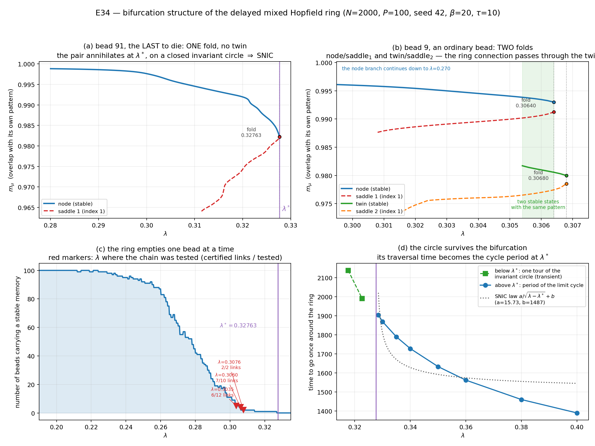

# E34 — Le cercle invariant : existe-t-il, et est-il le même pour tous les motifs ?

**Date :** 30–31 juillet 2026
**Système :** `t0·u̇ = −u + (1−λ)·J·tanh(βu) + λ·K·tanh(βu(t−τ))`, J hebbien
symétrique, K cyclique décalé non réciproque.
**Paramètres :** `N=2000`, `P=100` (`α=0.05`), `β=20`, `τ=10`, `t0=1`, seed `42`,
float64. Toute la dynamique passe par la réduction exacte P-dimensionnelle
(`ReducedDDE`).

---

## 0. La question

Le scénario établi par E9/E10/E12 est que le cycle de rappel meurt en λ\* par un
**SNIC** — une bifurcation nœud-col *sur un cercle invariant*. Ce scénario avait
été déduit de lois d'échelle (ralentissement en 1/√(λ−λ\*), valeur propre en
−c√(λ\*−λ)), jamais vérifié au niveau de la variété invariante elle-même.

Deux questions distinctes en découlent :

1. **Le cercle invariant existe-t-il** réellement en dessous de λ\*, et
   l'annihilation de la paire s'y produit-elle ?
2. **Est-ce le même cercle pour toutes les paires nœud-col** ? Autrement dit, les
   100 motifs sont-ils enfilés sur un seul objet qui perd ses perles une à une,
   ou chaque motif meurt-il sur sa propre structure ?

Et au-dessus de λ\* : **le cycle limite est-il unique**, ou plusieurs cycles
coexistent-ils, chacun ne visitant qu'une partie des motifs ?

---

## 1. Ce qui était acquis avant, et ce qui manquait

ET1″ (27 juillet) avait testé la **brique** du collier une perle à la fois, à
λ = λ_c(μ) − δ : la selle partenaire du fold a-t-elle une branche de W^u qui
retombe sur node_μ et l'autre qui atteint la perle suivante ? Résultat : positif
4 fois sur 4 là où une perle suivante existait.

Trois choses manquaient, et ce sont elles qui font l'objet de ce document :

- la brique était testée à **un λ par perle**, jamais toutes les perles au
  **même** λ — or c'est cela, « le même cercle » ;
- le tir de W^u était coupé à `t_max=1200`, alors qu'un tour d'anneau prend
  ~2000 u.t. : la cellule de la dernière perle était donc classée « non
  stationnaire » **à tort** ;
- rien n'avait été mesuré au-dessus de λ\*.

---

## 2. Expérience A — la fermeture du cercle de la dernière perle

**Protocole** (`src/e34_snic_closure.py`). À λ = λ_c(91) − δ, où la perle 91 est
la seule survivante : recharger la selle partenaire du fold certifiée par ET1″,
reconstruire son mode instable variationnel (une SVD, aucun travail de contour),
tirer la branche avant et intégrer **bien au-delà d'un tour** (t_max = 12000),
puis classer l'ω-limite.

Le test distingue trois issues : retour sur node_91 (cercle invariant fermé,
image SNIC) ; arrivée sur un autre nœud ; ou orbite récurrente de période stable
(cycle limite coexistant, donc **bistabilité et non SNIC**).

**Résultat.**

| δ | λ | tour | d_G(node_91) final | verdict |
|---:|---:|---:|---:|---|
| 0.005 | 0.322629 | 1991 u.t. | **3.5e−14** | cercle **fermé** |
| 0.010 | 0.317629 | 2138 u.t. | **~1e−13** | cercle **fermé** |
| 0.020 | 0.307629 | — | 1.07 | atterrit sur **node₄₃** |

Aux deux premiers δ, la branche avant parcourt l'anneau entier
(91→92→…→99→0→…→90) puis **revient exactement sur node_91**, stationnaire à la
précision machine. L'union nœud + selle + les deux connexions est un **cercle
invariant fermé portant une seule paire nœud-col**. C'est le SNIC, vérifié
directement.

Cela exclut aussi la bistabilité : le mouvement voyageur est **transitoire**, il
n'existe pas de cycle attracteur coexistant avec node_91 dans la région explorée
par W^u.

À δ=0.020 une seconde perle (43) est vivante et la branche s'arrête sur elle —
ce qui est le point de départ de l'expérience B.

---

## 3. Le recensement corrigé, et la structure fragmentée des branches

Le recensement des perles vivantes reposait sur la table de seuils E24, dont
l'audit du 27 juillet avait montré qu'elle est dépassée pour au moins 33 perles
sur 100. Sans recensement fiable, aucun test « à λ fixé sur toutes les perles »
n'a de sens.

**Protocole** (`src/e34_alive_ladder.py`). Pour chaque perle, marcher en λ de
0.15 à 0.36 par pas de 1e−3 (raffinement 1e−4) avec la solution précédente comme
amorce de Newton, et enregistrer **toutes** les fenêtres de λ où existe un
équilibre stable d'identité μ. Deux routes d'amorçage sont essayées à chaque pas
(continuation à chaud, puis amorce sur le motif), car la première seule manque
les nappes situées au-delà d'un fold.

**Résultat** (100 perles, 28 min) :

| lecture | perles |
|---|---:|
| table conforme | 58 |
| table en avance (fenêtre unique finissant au-dessus) | 8 |
| **branche fragmentée (plusieurs fenêtres stables)** | **34** |

Écart médian entre survie mesurée et table : **+1.4e−5** — la table est donc
juste pour la majorité. Le maximum est **+5.4e−2** (perle 31). Recoupement
indépendant : pour la perle 28 la continuation à chaud donne 0.232100 et
l'arclength 0.232122, soit un accord à **2e−5**.

Le point qui compte : « au-dessus de λ_c(μ), la perle μ a disparu » est **faux**.
Les perles réapparaissent dans des fenêtres étroites. C'est ce que la §5 explique.

**Limite de méthode, à énoncer clairement.** Le recensement n'est connu qu'à la
précision des routes de continuation employées. Le **flot** a révélé les perles
3, 49, 27 et 56 vivantes à des λ où ni Newton-au-motif ni le ladder ne les
atteignent. La procédure honnête est itérative — calculer les briques, ajouter
les perles découvertes, recommencer — et elle n'a pas été menée à convergence.

---

## 4. Expérience B — la chaîne à λ fixé

**Protocole** (`src/e34_chain_closure.py`). À un λ donné, pour chaque perle
vivante du recensement corrigé : nœud par continuation à chaud (l'amorce sur le
motif échoue près des folds), selle partenaire du fold par arclength **bornée par
le fold mesuré** et non par la table, certification d'indice 1 par principe de
l'argument avec escalade du contour, puis tir des deux branches de W^u avec
`t_max = 4000` — assez pour un tour complet.

Deux durcissements ont été introduits en cours de route, chacun après une mesure :

- **classement par identité**, jamais par appartenance au recensement : le
  verdict ne dépend donc plus de la table ;
- **résolution nœud canonique / jumeau** : un état stable portant le bon motif ne
  suffit pas. E17 avait découvert des *jumeaux de mémoire* — deux équilibres
  stables portant le même motif dominant. Un maillon n'est accepté que si
  l'atterrissage est à d_G < 1e−6 du nœud canonique de la perle visée. Ce
  durcissement a converti un maillon « positif » (43 → 49) en rupture : la
  branche atterrissait sur un **jumeau de 49**, à d_G = 0.0157 de node₄₉.

**Résultats.**

| λ | perles vivantes | maillons nœud-à-nœud | ruptures |
|---:|---:|---|---|
| 0.322629 | 1 | — | **cercle fermé** (exp. A) |
| 0.307629 | 2 | **2/2** — 43→91, 91→43 | **cercle unique fermé** |
| 0.306000 | 4 | 3/4 — 22→43, 43→91, 91→9 | 9 → jumeau de 9 |
| 0.303500 | 5 (+2) | 3/5 — 22→27, 43→56, 91→96 | 9 et 96 → leurs jumeaux |
| 0.298819 | 13 | 10/12 | 22 → jumeau de 22 ; 43 → jumeau de 49 |

À λ=0.298819 les dix maillons certifiés vont **tous** au successeur vivant
immédiat sur l'anneau, bouclage 96 → 1 inclus. La régularité est frappante : la
carte avant est la carte « successeur immédiat », à quelques exceptions près.

---

## 5. Ce qu'est le jumeau, et pourquoi la chaîne semblait rompue

**Mesure** (`src/e34_circle_trajectories.py`). Le jumeau porte **le même profil
de recouvrement que le nœud** — mêmes composantes secondaires, mêmes signes —
avec un recouvrement principal plus faible et un cross-talk uniformément plus
grand :

| perle 22, λ=0.298819 | m₂₂ | Σ\|m_ν\|, ν≠22 |
|---|---:|---:|
| nœud | +0.9905 | 1.9904 |
| **selle** | +0.9805 | 2.1169 |
| jumeau | +0.9762 | 2.1668 |

Et les trois états sont **quasi colinéaires** en métrique de Gram :
d(nœud,selle) + d(selle,jumeau) dépasse d(nœud,jumeau) de **3.2 %** (perle 9) et
**6.9 %** (perle 22), la selle étant strictement entre les deux.

Conclusion : la selle partenaire du fold d'une perle « cassée » est la
**séparatrice entre la mémoire et son propre jumeau**, pas la séparatrice vers la
perle suivante. Une brique cassée ne prouvait donc pas que le collier est
interrompu ; elle prouvait que l'arclength renvoyait une autre selle que celle
dont le collier a besoin.

**Vérification directe, sans aucune selle** (`src/e34_segment_scan.py`) :
échantillonner le segment node_μ → node_suivant et classer les ω-limites.

| segment | résultat |
|---|---|
| node₂₂ → node₂₇ (λ=0.298819) | s ∈ [0.21, 0.43] tombent sur **node₂₇** |
| node₉ → node₂₂ (λ=0.306000) | s ∈ [0.14, 0.43] tombent sur **node₂₂** |

**Les bassins sont adjacents dans les deux cas cassés.** La connexion d'anneau
existe.

---

## 6. Expérience C — le collier passe par les jumeaux

Si la selle₁ sépare le nœud de son jumeau, alors le jumeau — qui est lui aussi un
équilibre stable — doit avoir **sa propre** selle partenaire, et c'est elle qui
porterait la connexion d'anneau.

**Protocole** (`src/e34_twin_fold.py`) : obtenir le jumeau dynamiquement (tir de
la branche avant de selle₁), le continuer par arclength jusqu'à **son** fold,
certifier l'indice de la selle partenaire, tirer ses deux branches, et résoudre
chaque atterrissage contre le nœud canonique de la perle visée.

**Résultats.**

| μ, λ | selle du jumeau | W^u₋ | W^u₊ | verdict |
|---|---|---|---|---|
| 9, λ=0.3060 | rés. 5.2e−16, **indice 1**, fold 0.306927 | jumeau₉ (0.0000) | **node₂₂** (0.0000) | **collier fermé par le jumeau** |
| 22, λ=0.2988 | rés. 1.1e−13, **indice 1**, fold 0.299109 | jumeau₂₂ (0.0000) | **node₂₇** (0.0000) | **collier fermé par le jumeau** |
| 96, λ=0.3035 | rés. 2.8e−12, **indice 1**, fold 0.303898 | jumeau₉₆ (0.0000) | **un 2ᵉ jumeau de 96** | cascade, non terminée |

Pour les perles 9 et 22, la chaîne complète est

> **node_μ → selle₁ → jumeau_μ → selle₂ → node_suivant**

chaque maillon certifié d'indice 1 et chaque atterrissage exactement sur le nœud
canonique (d_G = 0.0000).

Pour la perle 96, la selle du jumeau mène à un **troisième** état stable portant
le motif 96 (d_G = 0.0638 du nœud, 0.0313 du jumeau) : c'est une **cascade**, et
la connexion d'anneau se fait plus loin sur l'échelle.

**Le collier a donc plus de perles que de motifs.** Un motif peut contribuer
plusieurs nœuds stables — la mémoire et ses jumeaux — reliés par des selles
d'indice 1.

---

## 7. Le diagramme de bifurcation

**Protocole** (`src/e34_branch_diagram.py`). Les quatre objets sont obtenus une
fois par le pipeline validé, puis **chacun est continué en λ** par Newton à chaud
(indifférent à la stabilité, donc les selles se continuent comme les nœuds). Une
branche s'arrête là où Newton cesse de converger : c'est le fold.

La déflation avait été essayée d'abord et ne fournit pas les branches instables —
elle divergeait déjà (résidu 1e−1) dans les diagnostics d'ET1′.

**Perle 91, la dernière à mourir** — panneau (a) :

| branche | λ | stabilité | m₉₁ |
|---|---|---|---|
| nœud | [0.28003, **0.32763**] | stable | 0.9988 → 0.9823 |
| selle₁ | [0.31143, **0.32763**] | indice 1 | 0.9641 → 0.9822 |

Les deux branches se terminent **ensemble** à λ = 0.32763 = λ\*, avec des
recouvrements convergents (0.9823 / 0.9822) : c'est un **fold simple**, et il n'y
a **pas de jumeau**. Combiné à l'expérience A, qui montre que cette paire est
posée sur un cercle invariant fermé, cela établit le SNIC.

**Perle 9, une perle ordinaire** — panneau (b) :

| branche | λ | stabilité |
|---|---|---|
| nœud | [0.27000, **0.30640**] | stable |
| selle₁ | [0.30080, **0.30640**] | indice 1 |
| jumeau | [0.30540, **0.30680**] | stable |
| selle₂ | [0.30160, **0.30680**] | indice 1 |

**Deux folds** (0.30640 et 0.30680) et une fenêtre λ ∈ [0.3054, 0.3064] où
**deux états stables portant le même motif coexistent**. C'est exactement la
« fragmentation » mesurée au ladder, vue de l'intérieur.

Les perles 22 et 96 donnent la même structure à quatre branches, avec un
ordonnancement différent des deux folds (pour la perle 22 le jumeau meurt
*avant* le nœud, à 0.29902 contre 0.30642).

---

## 8. Expérience D — un seul cycle limite au-dessus de λ\* ?

**Protocole** (`src/e34_cycle_uniqueness.py`). Partir de **chacun des 100
motifs** (a = e_μ, donc u = ξ^μ), intégrer au-delà du transitoire, et identifier
l'attracteur atteint : est-il périodique, de quelle période, la perle meneuse
avance-t-elle de +1 en balayant tout l'anneau — et surtout, est-ce **la même
orbite** quel que soit le motif de départ ?

Deux trajectoires sur le même cycle ne diffèrent que d'un décalage temporel. La
signature retenue est donc la **forme d'onde recalée en phase** : l'origine des
phases est le pic de m₀ (raffiné par ajustement parabolique), la période est
mesurée entre deux pics successifs du même motif, et m_ν(φ) est ré-échantillonné
sur une grille de phase commune.

**Trois artefacts numériques ont dû être éliminés**, chacun repéré par un pilote,
et la suite convergente qui en résulte est elle-même la preuve que le résidu est
numérique et non physique :

| empreinte | écart max |
|---|---:|
| état à l'instant de section (échantillonnage 1 u.t.) | 2.15 |
| idem, échantillonnage 0.1 u.t. | 0.167 |
| forme d'onde recalée, période issue des sections | 3.5e−2 |
| **forme d'onde recalée, période raffinée sur deux pics** | **4.1e−3** |

### Verdict sur les 100 motifs de départ

Chacun des 100 motifs sert de condition initiale (`u = ξ^μ`), aux deux λ. La
comparaison finale se fait contre une **référence unique** après fusion des
shards (`e34_uniqueness_merge.py`), et non shard par shard.

| λ | motifs | pas d'anneau | perles visitées | départs stationnaires | période | dispersion relative | écart max des formes d'onde | verdict |
|---|---|---|---|---|---|---|---|---|
| 0.35 | 100/100 | [1] | 100 | aucun | **1633.4619** | 1.5e−05 | 9.18e−03 | **UN SEUL cycle** |
| 0.33 | 100/100 | [1] | 100 | aucun | **1869.4064** | 4.6e−06 | 5.26e−03 | **UN SEUL cycle** |

Le maillon le plus lent est la perle **91** pour les 200 départs sans exception —
la même perle que celle dont la paire nœud/selle meurt en dernier (§ diagramme de
bifurcation). Le cycle garde donc la trace de la dernière digue tombée.

L'écart maximal (≈ 5–9·10⁻³) prend son sens par comparaison : une forme d'onde
mal recalée en phase donne **1.53**. Deux ordres de grandeur séparent « même
orbite » de « orbite différente » ; le résidu est l'erreur d'interpolation du
recalage, qui décroît avec le pas d'échantillonnage.

**Un quatrième artefact a dû être éliminé, et sa signature est ce qui le
démontre.** Aux deux λ, quelques départs (4 à λ=0.35, 5 à λ=0.33) sortaient à
distance 1.53 tout en ayant `steps=[1]`, `beads=100`, `peaks=100` — mêmes
invariants d'orbite que tous les autres. Leur `T_refined` valait 7.51 et 3.34 u.t.
au lieu de 1633. Cause : la période était lue sur les **deux derniers maxima
locaux** de m₀(t), et un épaulement dépassant le seuil 0.5 se faisait passer pour
le pic précédent. Correctif : ne garder que le maximum le plus haut dans chaque
grappe de demi-période, puis prendre la **médiane** des écarts compatibles à
±20 % avec l'estimation par section.

Ce qui certifie le diagnostic : **l'ensemble des perles à `T_refined` aberrant
coïncide exactement avec l'ensemble des perles à distance > 10⁻²**, aux deux λ.
Contrôle de non-régression : 4 perles déjà correctes relancées avec le code
corrigé — deux reproduisent leur forme d'onde au bit près, deux bougent de 2.3e−4
et 1.3e−3 (la période passe de « écart des deux derniers pics » à « médiane »),
soit sept fois sous le seuil de décision. Le verdict λ=0.35 ci-dessus provient
d'un jeu **entièrement homogène** : les 100 perles relancées avec le code
corrigé.

---

## 9. Réponses

**Le cercle invariant existe-t-il ?** Oui, et c'est mesuré directement, pas
déduit : à λ=0.322629 et 0.317629 la branche avant de la selle parcourt l'anneau
entier et revient sur son nœud à 3.5e−14. Le cercle est fermé, il porte la paire
qui s'annihile en λ\*, et le mouvement voyageur en dessous de λ\* est transitoire
— donc pas de bistabilité.

**Est-ce le même cercle pour toutes les paires ?** Là où une ou deux perles
survivent (λ ≳ 0.3076), oui, vérifié et fermé. En dessous, la chaîne des selles
partenaires du fold ne se referme pas — mais l'expérience C montre que ce n'était
pas une rupture du collier : la connexion d'anneau passe par les **jumeaux**, et
elle est certifiée nœud-à-nœud là où elle a été cherchée (2 cas sur 3, le
troisième étant une cascade non terminée).

L'état des preuves est donc : **le collier existe et il est plus long que le
nombre de motifs**. Ce qui n'est pas établi, c'est qu'il soit **un seul** cercle
à λ fixé quand beaucoup de perles survivent : il faudrait fermer la chaîne
complète, jumeaux compris, sur toutes les perles vivantes d'un même λ. Cela n'a
été fait qu'à n=1 et n=2.

**L'unicité au sens strict n'a jamais été testée** en dessous de λ\* : nous avons
exhibé *un* cercle, pas énuméré les cercles invariants.

---

## 10. Limites

1. Une seule taille (N=2000), une seule réalisation (seed 42), un seul τ. Aucune
   conclusion d'échelle (R2.10).
2. Le recensement des perles vivantes est une **borne inférieure** (§3).
3. La chaîne complète jumeaux compris n'a été fermée qu'à n=1 et n=2.
4. La cascade de la perle 96 n'a pas été poursuivie jusqu'à l'anneau.
5. Les cercles ne sont pas continués comme objets : pas de multiplicateurs de
   Floquet, pas de test d'attractivité du cercle en tant que tel.
6. Aucun prédicteur n'explique quelle perle décroche : les perles 9 et 22
   partagent le même fold (0.306500) et se comportent à l'inverse l'une de
   l'autre selon λ.

---

## 11. Fichiers

**Code** (`src/`)

| Fichier | Rôle |
|---|---|
| `e34_snic_closure.py` | expérience A : fermeture du cercle de la dernière perle |
| `e34_alive_ladder.py` | seuil de survie mesuré perle par perle, recensement corrigé |
| `e34_chain_closure.py` | expérience B : la chaîne à λ fixé, classement par identité et résolution jumeau/nœud |
| `e34_segment_scan.py` | adjacence des bassins, sans passer par une selle |
| `e34_twin_fold.py` | expérience C : la selle partenaire du jumeau |
| `e34_circle_trajectories.py` | trajectoires et états sauvegardés pour les figures |
| `e34_branch_diagram.py` | continuation en λ des quatre branches d'une perle |
| `e34_cycle_uniqueness.py` | expérience D : un cycle ou plusieurs, depuis les 100 motifs |
| `e34_uniqueness_merge.py` | fusion des tessons et verdict global |
| `e34_circle_figure.py`, `e34_bifurcation_figure.py` | figures |

**Figures** (`results/2_cycle_rappel_snic/figures/E34/`)

| Figure | Contenu |
|---|---|
| `figE34_invariant_circle.png` | le cercle des deux dernières perles dans le plan (m₄₃, m₉₁), le kymographe de l'onde, le certificat de fermeture, et le tour complet de la dernière perle |
| `figE34_bifurcation.png` | diagramme de bifurcation : perle 91 (un fold, λ\*), perle 9 (deux folds et bistabilité), vidage de l'anneau, temps de parcours du cercle et période du cycle |

**Données** (`results/2_cycle_rappel_snic/data/E34/`) : `E34_snic_closure_*`,
`E34_alive_ladder_*`, `E34_chain_lam*`, `E34_segment_*`, `E34_twin_fold_*`,
`E34_circle_traj_*`, `E34_branch_diagram_mu*`, `E34_cycle_uniqueness_*`.
