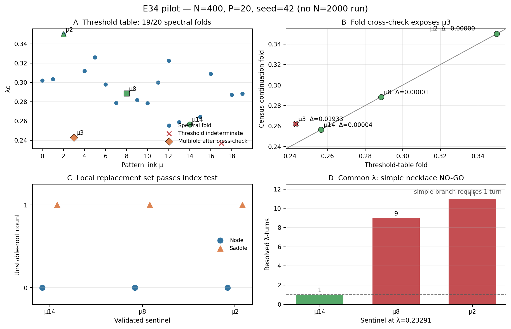

# E34 — Premiers résultats contrôlés du pilote N=400

**Date :** 23 juillet 2026  
**Paramètres :** `N=400`, `P=20` (`α=0.05`), `β=20`, seed `42`  
**Portée :** analyse des sorties existantes uniquement ; aucune nouvelle
simulation et aucun calcul `N=2000`.

## Verdict

Le pilote donne trois conclusions distinctes.

1. **Table statique : 19 folds spectraux résolus sur 20.** La liaison `μ=17`
   reste indéterminée à cause d'un ajustement spectral incohérent.
2. **Gate local : GO pour le jeu corrigé `{14,8,2}`.** Pour chaque liaison,
   le nœud a zéro racine instable, la selle en a exactement une, et le fold de
   la continuation concorde avec celui de la table.
3. **Gate commun : NO-GO pour un collier simple à trois liaisons.** À
   `λ=0.2329096`, `μ=14` reste une branche simple, mais `μ=8` et `μ=2`
   présentent respectivement 9 et 11 retournements résolus de `λ`. La géométrie
   « un nœud — un fold — une selle » n'est donc pas commune aux trois liaisons.

Ce NO-GO réfute la construction numérique d'un **collier simple** sur ces
sentinelles. Il ne démontre ni l'absence de toute connexion hétérocline, ni
l'absence de dynamique récurrente sur une géométrie multifold plus complexe.



## 1. Table des seuils

Le fichier de seuils emploie la méthode
`pseudo_arclength_spectral_v2`. Un `λ_c` n'est accepté que si la continuation
pseudo-arclength traverse un retournement et si la valeur propre statique
dominante change de signe de part et d'autre.

| Quantité | Valeur |
|---|---:|
| Folds spectraux validés | 19/20 |
| Liaison indéterminée | `μ=17` |
| Raison pour `μ=17` | `arclength_spectral_fit_failed` |
| `min λ_c` parmi les 19 | 0.2429096 (`μ=3`) |
| médiane `λ_c` | 0.2884590 (`μ=8`) |
| `max λ_c` | 0.3499078 (`μ=2`) |
| largeur maximale d'intervalle | 4.5079×10⁻⁴ |
| erreur maximale de l'ajustement | 2.2540×10⁻⁴ |
| `max |eig_threshold_side|` | 1.2410×10⁻² |
| résidu maximal côté seuil | 9.5608×10⁻¹² |

Ces contrôles valident numériquement les folds locaux à la résolution annoncée.
Ils ne valident pas encore l'unicité globale du fold le long de chaque composante
de branche.

## 2. Gate local et anomalie multifold de μ=3

La porte de cohérence appliquée a posteriori est

`|λ_fold,census − λ_c,table| ≤ max(0.002, 2.5 × largeur_table)`.

| μ | rôle | `λ_target` | fold table | fold census | écart | `(n_unst node, saddle)` | verdict |
|---:|---|---:|---:|---:|---:|---:|---|
| 3 | minimum initial | 0.2229096 | 0.2429096 | 0.2622405 | 1.9331×10⁻² | (0, 1) | **indéterminé : mismatch/multifold** |
| 14 | minimum de remplacement | 0.2365253 | 0.2565253 | 0.2565623 | 3.7073×10⁻⁵ | (0, 1) | **GO** |
| 8 | médiane | 0.2684590 | 0.2884590 | 0.2884476 | 1.1485×10⁻⁵ | (0, 1) | **GO** |
| 2 | maximum | 0.3299078 | 0.3499078 | 0.3499043 | 3.5529×10⁻⁶ | (0, 1) | **GO** |

Le statut brut `ok` de `μ=3` avait été écrit avant l'ajout de la porte croisée.
Le nœud à `λ=0.2229096` appartient bien à la branche mémoire suivie par la table,
mais la table rencontre d'abord le fold `0.2429096`, tandis que la continuation
longue rapporte un maximum ultérieur à `0.2622405`. Atteindre ce second maximum
après avoir franchi le premier impose au moins un minimum intermédiaire : la
composante est multifold. La selle ramenée jusqu'à la cible n'est donc pas la
selle locale du premier fold.

Le remplacement par `μ=14` restaure un échantillonnage
minimum–médiane–maximum contrôlé. Le **jeu local valide est `{14,8,2}`**.

## 3. Gate à λ commun

Les trois liaisons corrigées ont été testées à la même valeur
`λ_common=0.2329096248`.

| μ | retournements résolus de λ | mismatch du fold | statut | spectre DDE |
|---:|---:|---:|---|---|
| 14 | 1 | 3.7073×10⁻⁵ | `ok` | nœud 0, selle 1 |
| 8 | 9 | 1.1485×10⁻⁵ | `multifold_indeterminate` | non calculé après NO-GO |
| 2 | 11 | 3.5529×10⁻⁶ | `multifold_indeterminate` | non calculé après NO-GO |

Les folds de table restent cohérents avec les maxima globaux rapportés, mais le
nombre de retournements montre que les branches `μ=8` et `μ=2` traversent une
succession de segments stables et instables avant de revenir à `λ_common`. Une
selle d'indice 1 éventuellement obtenue à la fin ne peut pas être attribuée sans
ambiguïté au nœud local choisi.

**Décision : ne pas lancer E34 à N=2000 sur l'hypothèse du collier simple.**
Une éventuelle suite devrait d'abord reformuler l'objet comme graphe multifold
et identifier chaque segment par continuation globale, ce qui constitue un axe
scientifique différent et plus coûteux.

## 4. Limites

- Une seule taille (`N=400`) et une seule seed (`42`) ont été examinées.
- `μ=17` reste non résolue dans la table.
- Le gate local vérifie l'indice spectral des paires, pas leurs variétés
  instables ni les connexions hétéroclines.
- Les cas multifold sont classés comme indéterminés avant le calcul spectral :
  les valeurs `-1` dans les champs de comptage signifient « non calculé », pas
  « nombre négatif de racines ».
- Aucun résultat de ce document ne doit être présenté comme une limite
  thermodynamique ou une validation multiseed.

## 5. Reproductibilité et intégrité

Analyse et régénération :

```bash
MPLCONFIGDIR=/tmp/e34-mpl-cache \
  /opt/homebrew/Caskroom/miniforge/base/envs/mcmc_env/bin/python \
  src/e34_first_results.py
```

Le script vérifie les schémas, les paramètres, les ensembles de motifs, les
statuts et les nombres de retournements avant d'écrire :

- `results/2_cycle_rappel_snic/E34_RESULTS.json`
- `results/2_cycle_rappel_snic/figures/E34/figE34_first_results.png`

Checksums SHA-256 des quatre entrées :

| Entrée | SHA-256 |
|---|---|
| table corrigée | `10c013b51382447f17b502ca1df8e799c5bcfe5066af280c8327f75d9b29f993` |
| sentinelles locales originales | `d86d20c68e9bda014c1edc1fc24e2e908f81e60e99f366b2da167c2940f4ba9f` |
| remplacement `μ=14` | `8ba48e3daa9fa563186b54803deb00896ca3d11f2099a819a6da98f5e51d4a7f` |
| gate commun | `500f5c81834663153b81607eab77c09de64fa4accec87f4899b16e2fc458790a` |

Checksums des sorties générées :

| Sortie | SHA-256 |
|---|---|
| `E34_RESULTS.json` | `2132434e2e7dc8daba8b5fbfd319215cf9f08195304309f08894bc5b25062480` |
| `figE34_first_results.png` | `c106919b35c546492b7fc768b3ef9963d17603853467f896f07a8a3a9885fce0` |
