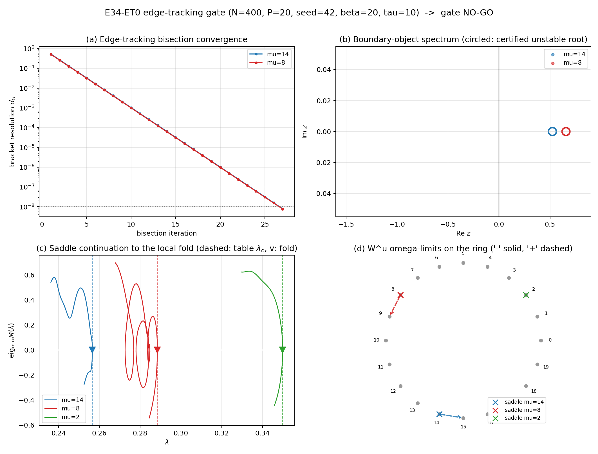

# E34-ET0 — Résultats du gate d'edge-tracking à λ fixé (pilote N=400)

**Date :** 24 juillet 2026
**Paramètres :** `N=400`, `P=20` (`α=0.05`), `β=20`, `τ=10`, `t0=1`, seed `42`
**Portée :** pilote N=400, sentinelles `{14, 8, 2}`, à `λ_local(μ) = λ_c(μ) − 0.020`
(bisection `λ_c` lue dans la table pilote E34). Aucune production N=2000. float64
CPU exclusivement ; aucune matrice N×N de couplage.
**Protocole préspécifié :** `roadmaps/E34_ET0_PROTOCOL.md` (verrouillé avant tout
calcul).

---

## Verdict — Gate E34-ET0 : **NO-GO**

Selon la règle GO gelée du protocole (§g : GO ⟺ les trois sentinelles reçoivent
le verdict **positif**), le gate est **NO-GO**. Vocabulaire R2.1 par sentinelle :

| μ | rôle | verdict R2.1 | résumé |
|---:|---|---|---|
| 14 | minimum | **positif** | tous les points (a)–(f) satisfaits |
| 8 | médiane | **limité** | (a)–(d),(f) machine-exacts ; seul (e) échoue (branche multifold en λ) |
| 2 | maximum | **numériquement indéterminé** | inadmissible au protocole : unique nœud vivant à `λ_local` (pas de voisin à bisecter) |

Le NO-GO est un **résultat de gate**, pas une réfutation dynamique. Il **n'ouvre
pas** ET1 (N=2000), qui reste conditionné à un GO complet, et **ne réhabilite pas
le collier simple** (le NO-GO du collier simple par continuation longue, pilote
antérieur, est maintenu ; le graphe multifold reste l'objet scientifique de
repli). Point positif majeur, à énoncer prudemment : la **topologie hétérocline à
λ fixé `nœud → selle → nœud`** est **intacte sur les 2/2 sentinelles testables**
(μ=14, μ=8), avec objet de bord certifié d'indice 1 machine-exact et variétés
instables robustes atterrissant sur les nœuds **adjacents**. C'est une **forte
évidence numérique à N=400 sur deux sentinelles** — rien de plus (pas de limite
thermodynamique, pas de statistique multiseed, μ=2 non testable en l'état).



---

## 1. Tableau par sentinelle (critères (a)–(f) du protocole)

Distances en métrique de Gram `d_G(a,b)² = ‖X(a−b)‖²/N`. `s*` = point critique de
la bissection sur `a(s) = (1−s)·a_node_μ + s·a_far`.

| Grandeur | μ=14 | μ=8 | μ=2 |
|---|---:|---:|---:|
| `λ_local` | 0.2365253 | 0.2684590 | 0.3299078 |
| `λ_c` (table) | 0.2565253 | 0.2884590 | 0.3499078 |
| **(a)** bassin A = node_μ, `eigmax_M` | −0.32642 | −0.90758 | −0.50126 |
| **(a)** bassin B (attracteur voisin) | node 15 | node 9 | — |
| **(a)** séparation `d_G(A,B)` | 1.0655 | 1.0294 | 5.7×10⁻¹² |
| **(a)** admissible | oui | oui | **non** |
| **(b)** `s*` segment S1 (node–node) | 0.146410 | 0.206293 | — |
| **(b)** `s*` segment S2 (node–perturbé) | 0.104614 | 0.147266 | — |
| **(c)** accord dt (0.01 vs 0.005) | oui | oui | — |
| **(c)** accord segments `d_G` | 8.75×10⁻¹⁴ | 3.37×10⁻¹⁶ | — |
| **(d)** résidu Newton `‖F‖/√N` | 1.29×10⁻¹⁴ | 1.99×10⁻¹⁶ | — |
| **(d)** `d_G`(bord edge, selle arclength) | 3.56×10⁻¹³ | 4.67×10⁻¹⁴ | — |
| **(d)** racines instables (nœud, selle) | (0, 1) | (0, 1) | — |
| **(d)** `z_u` (argument+localize) | 0.5232208 | 0.6564183 | — |
| **(d)** `z_u` racine réelle (cross-check) | 0.5232208 | 0.6564183 | — |
| **(d)** `eigmax_M`(selle) (>0) | +0.55454 | +0.68402 | — |
| **(e)** `λ_fold` continuation | 0.2565623 | 0.2884476 | — |
| **(e)** `|λ_fold − λ_c|` | 3.71×10⁻⁵ | 1.15×10⁻⁵ | — |
| **(e)** retournements (montée / descente) | 1 / 0 | **7** / 0 | — |
| **(e)** rejoint le fold sans perte d'identité | oui | **non** | — |
| **(f)** gate linéaire W^u (err. rel. sur `z_u`) | 1.9×10⁻³ | 3.0×10⁻⁵ | — |
| **(f)** ω-limite branche « − » | node 14 | node 8 | — |
| **(f)** ω-limite branche « + » | node 15 | node 9 | — |
| **(f)** robustesse (ε∈{1e−4,1e−3}, dt∈{0.01,0.005}) | 4/4 & 4/4 | 4/4 & 4/4 | — |
| temps mur | 201.3 s | 173.0 s | 4.6 s |

Chaque objet de bord a été localisé indépendamment par edge-tracking, puis poli
par Newton `tol=1e−12`, et **coïncide à la précision machine avec la selle
obtenue par arclength à travers le fold** (`d_G ≤ 5×10⁻¹³`) — deux méthodes
indépendantes désignent le même point. Le comptage des racines instables
(principe de l'argument sur `det T_P`, phase par `slogdet`, stable sous
doublement de grille ET déplacement de contour) donne **exactement 1** racine
pour la selle, **réelle** (`|Im z_u| < 1e−8`), confirmée par la racine réelle
`rightmost_real_root` et par le signe `eigmax_M > 0` (identité Δ(0) = −M). Le mode
de tir W^u est le vecteur propre de la matrice **variationnelle** `T_red`
(convention `S·Dm`) : le gate linéaire retrouve le taux `z_u` à `≤ 2×10⁻³`.

---

## 2. Analyse honnête, sentinelle par sentinelle

### 2.1 μ=14 — verdict **positif** (a)–(f) tous satisfaits

Cas d'école. Deux bassins nettement séparés (node_14 / node_15, `d_G = 1.07`) ;
edge-tracking convergent (les deux dt et les deux segments donnent le même objet à
`8.8×10⁻¹⁴`) ; objet de bord = équilibre à `‖F‖/√N = 1.3×10⁻¹⁴`, **exactement 1**
racine instable réelle `z_u = 0.5232` ; continuation montante rejoignant le fold
local `0.256562` (écart `3.7×10⁻⁵` à la table) avec **un seul** retournement et
identité conservée ; les deux branches de W^u atterrissent de façon robuste sur
les nœuds **adjacents** `14` (branche « − ») et `15` (branche « + »), pour les
4 réglages ε×dt. C'est la signature `node_14 → saddle_14 → node_15` du collier,
établie ici indépendamment de l'arclength.

### 2.2 μ=8 — verdict **limité** : dissociation topologie-dynamique / géométrie-de-branche

**Point central du run.** La sentinelle médiane présente une **dissociation
frappante** :

- **Topologie dynamique à λ fixé : PROPRE.** L'objet de bord est un équilibre à
  `‖F‖/√N = 2.0×10⁻¹⁶` (machine), d'**indice exactement 1** (`z_u = 0.6564`,
  réel, cross-checks concordants, `eigmax_M = +0.684`), identique à la selle
  d'arclength à `4.7×10⁻¹⁴`. Ses deux variétés instables atterrissent de façon
  **robuste** (4/4 réglages chacune) sur les nœuds **adjacents** `8` et `9`. Le
  gate linéaire est exact à `3×10⁻⁵`. Autrement dit, à `λ_local`, la structure
  `node_8 → saddle_8 → node_9` **existe et est certifiée**.
- **Géométrie de branche en λ : MULTIFOLD.** La seule chose qui échoue est le
  critère d'identité R2.5 de la continuation (e) : la branche mémoire suivie du
  nœud jusqu'à la selle traverse **7 retournements** en λ (panneau (c) de la
  figure : la courbe rouge `eigmax_M(λ)` s'enroule plusieurs fois autour de
  `eig = 0`). **Et pourtant** la valeur terminale du fold, `0.2884476`, **coïncide
  avec la table à `1.15×10⁻⁵`**.

**Interprétation.** Le multifold est une propriété de la **géométrie de la branche
d'équilibres paramétrée par λ**, PAS de la topologie du flot à λ fixé. La selle
d'indice 1 est un objet dynamique bien défini et unique à `λ_local` ; son
existence et son rôle de col entre `node_8` et `node_9` ne dépendent pas de la
tortuosité du chemin de continuation qui la relie au nœud quand on fait varier λ.
Le fait que le fold terminal retombe exactement sur `λ_c(8)` de la table montre
que la mort de la mémoire 8 se produit bien au seuil attendu ; simplement, la
composante de branche `a_8(λ)` visite plusieurs plis avant. Conclusion honnête :
la conjecture-collier « une paire nœud–selle par un fold **simple** » échoue pour
μ=8 **au sens de la géométrie de branche** (R2.5, `identity_lost`/`multifold`),
mais la brique **dynamique** dont le collier a besoin — un col d'indice 1 dont
`W^u` joint les deux nœuds voisins — est, elle, **présente et certifiée**. C'est
exactement la nuance que le NO-GO de gate ne doit pas écraser : verdict **limité**,
pas **négatif**.

### 2.3 μ=2 — verdict **numériquement indéterminé** : inadmissibilité de protocole (limitation, pas découverte)

À `λ_local(2) = 0.3299078`, la lecture du recensement des nœuds vivants
(`λ_c(k) > λ_local + 3×10⁻³`) donne **un seul nœud vivant : le nœud 2 lui-même**.
Toutes les autres mémoires sont déjà mortes à ce λ (μ=2 est le maximum `λ_c` du
pilote, ≈ λ* local). Il n'existe donc **aucun nœud adjacent** contre lequel
bisecter : le point de sonde du successeur (`2·ξ³`, μ=3 mort) reflue vers le
bassin de node_2 lui-même (séparation `d_G = 5.7×10⁻¹²`), et le critère
d'admissibilité (a) (`d_G(A,B) > 0.05`, B ≠ node_μ) **échoue par construction**.
Statut `basin_ambiguous` en 4.6 s.

**Ce n'est pas un résultat dynamique** : c'est une **limitation intrinsèque du
protocole ET0 pour la liaison extrême**, où l'edge-tracking nœud–nœud n'est pas
défini faute de second nœud. La selle_2 existe (le pilote antérieur l'avait
certifiée d'indice 1 par arclength à `λ_common`, `z_u ≈ 0.414`) ; elle n'est
simplement pas atteignable par la **méthode nœud–nœud** ici.

**Amendement candidat ET0′ (NON exécuté — nécessite l'accord de l'orchestrateur).**
Deux options, à figer dans un protocole révisé avant tout run :
1. **Bracketer contre le cycle / un autre attracteur.** À `λ_local(2)` le seul
   attracteur ponctuel est node_2 ; l'autre bassin est celui du cycle de rappel
   (ou du chaos de la fenêtre mixte). Edge-tracker entre `a_node_2` et un point du
   bassin du cycle transporté depuis `λ*+δ` (cf. E34d/E34e) isolerait l'objet de
   bord node_2 ↔ cycle, à certifier ensuite comme au (d).
2. **Descendre à un λ où un voisin est vivant.** Choisir `λ_2* = min(λ_c(2),
   λ_c(3)) − 0.020` (ou tout λ où node_3 — ou un autre voisin d'anneau — est
   vivant), y faire l'edge-tracking nœud–nœud standard, puis **continuer** la selle
   trouvée vers `λ_local(2)` avec le garde-fou d'identité. Cela reste dans l'esprit
   ET0 (segment droit nœud–nœud) au prix d'un λ de bracketing différent du λ local.

Ces deux pistes sont **explicitement marquées comme non lancées** : elles
constituent une raffinement `ET0′` à valider par l'orchestrateur, pas un résultat
du présent run.

---

## 3. Anomalies secondaires (pilote N=400)

Traitées en < 1 s au total, secondaires au gate.

- **μ=17 — non résolue (maintenue).** Nouvelle tentative avec arclength resserré
  (`bisect_tol = 1×10⁻⁵`, per roadmap §9) : statut inchangé
  `arclength_spectral_fit_failed` (`slope = −7.21×10⁻²`, `intercept = 0.207238`,
  `sample_max = 0.212473`, `fit_error = 2.82×10⁻²` > tolérance). L'ajustement
  spectral `λ = λ_c + c·eigmax²` reste incohérent : `λ_c(17)` demeure
  **indéterminé** dans la table pilote (le fold, s'il existe, n'est pas un
  selle-nœud simple ajustable — vraisemblablement multifold, comme μ=3/μ=8).
- **μ=3 — multifold confirmé.** Comptage des retournements sur la composante de
  branche : **7 retournements**, `λ_fold,cont = 0.262241`. Cela **confirme** le
  mismatch table/census du pilote (table `0.242910` vs census `0.262241`, écart
  `1.93×10⁻²`) : la table rencontre d'abord un pli à `0.2429`, mais la
  continuation longue atteint un maximum ultérieur à `0.2622` après plusieurs
  plis. Statut **`multifold_indeterminate`** confirmé — la selle ramenée à la
  cible n'est pas la selle locale du premier fold.

Ces deux anomalies renforcent le constat μ=8/μ=3 : **plusieurs composantes de
branche du pilote N=400 sont multifold en λ**, indépendamment de la topologie du
flot à λ fixé.

---

## 4. Ce qui reste OUVERT vs RÉFUTÉ

**RÉFUTÉ / maintenu comme NO-GO :**
- Le **collier simple** « un nœud — un fold **simple** — une selle, appariement
  global par continuation » : NO-GO maintenu (pilote antérieur, continuation
  longue 9–11 retournements). Le présent run le **corrobore par un autre biais** :
  au moins μ=8 et μ=3 (et probablement μ=17) sont **multifold en λ** — la
  géométrie de branche n'est pas celle d'un fold simple.
- Le gate ET0 lui-même : **NO-GO** (3 positifs requis, obtenus positif/limité/
  indéterminé).

**OUVERT (forte évidence numérique partielle, à ne pas surinterpréter) :**
- La **topologie hétérocline à λ fixé `node_μ → saddle_μ → node_{μ+1}`** semble
  **intacte** : sur les 2/2 sentinelles testables (μ=14, μ=8), l'objet de bord est
  une selle d'indice 1 certifiée machine-exacte dont les deux variétés instables
  joignent les nœuds adjacents, de façon robuste en ε et dt. **Portée stricte :
  forte évidence numérique à N=400, seed 42, sur DEUX sentinelles — ni limite N→∞,
  ni statistique multiseed, ni la sentinelle extrême μ=2.**
- Le **graphe multifold** (indexation des segments entre retournements, connexions
  segment par segment) **reste l'objet scientifique de repli permanent** : c'est
  la formulation correcte dès lors que la géométrie de branche est multifold, même
  là où l'edge-tracking réussit ponctuellement (μ=8).
- μ=2 (liaison extrême, ≈ λ*) : **non tranché** — inadmissible au protocole actuel,
  à reprendre via `ET0′` (accord orchestrateur requis).

**INTERDIT sans nouvelle approbation :** production N=2000 complète ; ET1 ; re-run
μ=2 à λ plus bas ou bracketing contre le cycle (`ET0′`).

---

## 5. Caveats honnêtes

- Une seule taille (`N=400`), une seule seed (`42`), **deux** sentinelles
  effectivement testées sur trois. Aucune conclusion thermodynamique ou multiseed.
- Le collier n'est PAS un attracteur global dans la fenêtre mixte ; les ω-limites
  W^u testées ici sont restées laminaires (aucune capture chaotique observée à ces
  λ), ce qui est cohérent mais ne teste pas la robustesse au chaos à λ plus élevé.
- Le succès (d) de μ=8 malgré 7 retournements en λ illustre que **la localisation
  d'un objet de bord d'indice 1 à λ fixé n'implique pas l'appariement global
  par continuation** — le point épistémique R2.12(ii). Ne pas conclure d'un objet
  de bord propre à un collier fermé.
- μ=2 : `basin_ambiguous` est une **limite de méthode**, pas l'absence de selle.

---

## 6. Fichiers produits (chemins absolus)

- Protocole : `roadmaps/E34_ET0_PROTOCOL.md`
- Code : `src/e34b_edge_tracking.py`, `src/e34_ET0_figures.py`
- Données (run `20260724T124822_763937`) :
  - `results/2_cycle_rappel_snic/data/E34/E34_ET0_results_20260724T124822_763937.npz`
    (champs `muNN_a_node`/`muNN_a_saddle` en coefficients ET `muNN_m_node`/
    `muNN_m_saddle` en overlaps physiques, `muNN_edge_history`, résidus, comptes
    de racines instables, `z_u`, `real_root`, folds et retournements, séparations,
    `edge_vs_arclength_dG`).
  - `results/2_cycle_rappel_snic/data/E34/E34_ET0_summary_20260724T124822_763937.json`
    (enregistrements complets, ω-limites par ε/dt, anomalies).
  - `results/2_cycle_rappel_snic/data/E34/E34_ET0_log_20260724T124822_763937.txt`
- Figure : `results/2_cycle_rappel_snic/figures/E34/figE34_ET0_edge_tracking.png`
  (dpi 170, 4 panneaux, labels anglais).

**Reproductibilité :**
```bash
OMP_NUM_THREADS=1 /opt/homebrew/Caskroom/miniforge/base/envs/mcmc_env/bin/python \
  src/e34b_edge_tracking.py --production --links 14,8,2
```
Table de seuils de référence :
`results/2_cycle_rappel_snic/data/E34/E34_thresholds_N400_P20_s42_20260723T191104_587960.npz`.
Temps mur total : **379.3 s** (smoke μ=14 préalable : 67 s).

---

# ET0′ — Amendement (24 juillet 2026, post-verdict)

**Contexte.** Suite au NO-GO ET0, l'orchestrateur + l'utilisateur ont autorisé
l'amendement `ET0′` (N=400 uniquement) spécifié en fin de
`roadmaps/E34_ET0_PROTOCOL.md` (section « AMENDEMENT ET0′ »). Objet : lever
l'inadmissibilité de μ=2 en le testant à un λ plus bas où un voisin d'anneau est
vivant, puis continuer la selle certifiée vers le haut jusqu'à son fold, et
réévaluer le gate en **deux critères disjoints** GATE-DYN / GATE-BRANCH.
**Aucune production N=2000 lancée.** Temps mur ET0′ : **330.4 s**.

Fichiers : `E34_ET0prime_{results,summary,log}_20260724T131345_987829.*`,
figure `figE34_ET0prime.png`.

## ET0′.1 — μ=2 à λ′ = λ_c(3) − 0.020 = 0.2229096 (test primaire)

À `λ′ = 0.2229096`, node_2 **et** son successeur node_3 sont tous deux vivants
(node_3 : `λ_c(3) = 0.2429` > `λ′ + 3e−3`). Segment principal S1 = node_2 → node_3.

| Grandeur (μ=2 à λ′) | Valeur |
|---|---:|
| bassin A = node_2 / bassin B (successeur) | node 2 / **node 3** |
| séparation `d_G(A,B)` | 1.1670 |
| admissible | **oui** |
| `s*` S1 (node2–node3) / S2 (node2–perturbé) | 0.332587 / (converge) |
| accord dt (0.01/0.005) & segments `d_G` | oui / 1.77×10⁻¹⁴ |
| résidu Newton bord `‖F‖/√N` | 3.14×10⁻¹⁶ |
| identité de branche (μ=2) | oui (argmax ∈ {2,3}) |
| racines instables (nœud, selle) | (0, 1) |
| `z_u` / racine réelle (cross-check) | 0.5374745 / 0.5374745 |
| `eigmax_M`(selle) (>0) | +0.52291 |
| **`d_G`(objet edge, selle arclength)** | **0.15857** |
| gate linéaire W^u (err. rel. `z_u`) | 2.3×10⁻⁴ |
| ω-limite branche « − » | **node 2** (robuste 4/4) |
| ω-limite branche « + » | **ω = −4** (robuste 4/4) |
| continuation montante : fold atteint | **0.3499043** (= `λ_c(2)` à 3.55×10⁻⁶) |
| retournements montée (`turns_up`) | **17** |
| rejoint le fold sans perte d'identité | **non** |
| verdict R2.1 | **limité** |

**Deux constats décisifs :**

1. **L'objet de bord n'est PAS la selle du collier `saddle_2`.** L'edge-tracking
   node_2→node_3 localise bien un **équilibre d'indice 1 machine-exact**
   (`‖F‖/√N = 3.1×10⁻¹⁶`, `z_u = 0.537` réel, cross-checks concordants), mais il
   est **distant de `0.159` en `d_G` de la selle d'arclength** de la branche
   mémoire-2. Autrement dit, à `λ′`, la frontière du bassin de node_2 rencontrée en
   premier le long du segment est le col node_2 ↔ **un autre bassin**, pas le col
   node_2 ↔ node_3 de la conjecture-collier. La branche mémoire-2 étant multifold
   (voir point 2), plusieurs selles d'indice 1 coexistent ; l'edge-tracking en
   isole une, l'arclength une autre.

2. **La branche mémoire-2 est fortement multifold : la continuation montante rejoint
   le fold `λ_c(2) = 0.3499043` (mismatch `3.55×10⁻⁶`) mais à travers 17
   retournements** (figure panneau (c) : `eigmax_M(λ)` s'enroule 17 fois entre
   `λ′` et le fold). Le fold terminal est le bon (coïncidence machine avec la
   table), mais le chemin est tout sauf un pli simple. GATE-BRANCH échoue.

## ET0′.2 — Identification de `ω = −4` (branche W^u « + »)

`ω = −4` est le label du classificateur d'ω-limite signifiant : **trajectoire
stationnaire (elle converge vers un point fixe), mais ce point fixe n'est AUCUN
des nœuds-mémoire du recensement** (`d_G` au nœud le plus proche ≥ `NODE_TOL`,
sans identification non ambiguë). Diagnostic dédié (intégration W^u « + »,
`ε = 1e−3`, `dt = 0.01`, `T = 450` t.u., puis polissage Newton) :

- point d'arrivée = **équilibre mixte multi-motifs**, poli à `‖F‖/√N = 2.2×10⁻¹⁶` ;
- composantes dominantes `|a|` : motif **18** (0.391), **14** (0.313), **19**
  (0.307), 0 (0.252) — **état « mélange » à 3–4 motifs** (14/18/19/0), PAS une
  mémoire inclinée (`memory_branch_identity` = False pour tout argmax) ;
- `eigmax_M = −0.0545` → **attracteur faiblement stable** ;
- distance au nœud du recensement le plus proche : `d_G(·, node_18) = 0.78`
  (loin de toute mémoire pure), `d_G(·, node_3) ≫` (le successeur n'est pas atteint).

**Conclusion :** la branche instable « avant » de l'objet de bord μ=2 à `λ′`
**n'atterrit pas sur le nœud adjacent node_3** ; elle tombe dans un **état-mélange
stable** (verre de spin de type Hopfield, attendu sous la capacité). La topologie
`node_2 → objet → node_3` est donc **rompue à ce λ bas**.

## ET0′.3 — Bracket secondaire exploratoire à `λ_local(2) = 0.3299` (non gating)

Le cycle n'existe pas encore à cette taille (`λ* = λ_c(2) = 0.3499`), donc pas de
bracketing vs-cycle. Sonde de 6 IC diffuses autour de node_2 : attracteurs atteints
= `{node 2, « other »}`. L'attracteur « other » (atteint 3 fois sur 6, stationnaire,
`d_G = 1.55` de node_2) est un **second bassin** distinct à 0.3299 — vraisemblablement
le même type d'état-mélange qu'en ET0′.2. Un edge-tracking node_2 ↔ « other » y
serait donc possible (exploratoire), mais isolerait à nouveau un col node_2/mélange,
pas la selle du collier. **Non poursuivi** (non gating).

## ET0′.4 — Tableau de bord à double critère (3 sentinelles)

**GATE-DYN** (topologie dynamique à λ fixé) = bassins admissibles ∧ edge convergent
∧ objet de bord d'indice 1 certifié ∧ **coïncidant avec la selle d'arclength**
(`d_G < 1e−4`) ∧ W^u robuste atterrissant sur les **nœuds adjacents**.
**GATE-BRANCH** (géométrie de branche en λ) = la continuation rejoint le fold local
sans perte d'identité (**exactement 1 retournement**).

| μ | λ testé | verdict R2.1 | GATE-DYN | GATE-BRANCH | edge=arclength ? | W^u → adjacents ? | retournements |
|---:|---:|---|:--:|:--:|:--:|:--:|---:|
| 14 | 0.2365 (λ_local) | positif | **PASS** | **PASS** | oui (3.6e−13) | oui (14/15) | 1 |
| 8 | 0.2685 (λ_local) | limité | **PASS** | fail | oui (4.7e−14) | oui (8/9) | 7 |
| 2 | 0.2229 (λ′) | limité | **fail** | fail | **non (0.159)** | **non (2 / mélange)** | 17 |
| **Score** | | | **2 / 3** | **1 / 3** | | | |

**GATE-DYN = 2/3, GATE-BRANCH = 1/3.**

## ET0′.5 — Statut de l'hypothèse-collier (vocabulaire R2.1)

- **μ=14, μ=8 : forte évidence numérique (positif GATE-DYN)** pour la brique
  dynamique `node_μ → selle d'indice 1 → node_{μ+1}` à λ fixé — objet de bord
  machine-exact = selle d'arclength, W^u joignant les nœuds adjacents, robuste en
  ε et dt. À N=400, seed 42, deux sentinelles.
- **μ=2 : contre-exemple dynamique CANDIDAT, mais à λ bas hors du régime pertinent.**
  À `λ′ = 0.2229` — soit **0.127 SOUS le fold `λ_c(2) = 0.3499`** — l'edge-tracking
  node_2→node_3 n'isole PAS la selle du collier (elle diffère de l'arclength de
  0.159) et la variété instable avant tombe dans un **état-mélange**, pas sur
  node_3. **Ce qui est établi** : à ce λ bas, la topologie `node_2 → col → node_3`
  est rompue (négatif local). **Ce qui n'est PAS établi** : le comportement dans le
  **régime près du fold** `λ ≲ λ_c(2)` — le seul régime où le SNIC de naissance du
  cycle a lieu — n'a PAS été testé pour μ=2 (impossible en edge-tracking nœud–nœud
  faute de voisin vivant à 0.3299 ; c'était toute la difficulté d'origine).
- **Implication honnête :** l'existence, à λ bas, d'un col node_2/mélange et d'un
  état-mélange stable **ne réfute pas** l'hypothèse-collier près du fold ; elle
  montre que **la géométrie des bassins loin sous le fold est plus riche** (des
  attracteurs-mélange coexistent, cf. E20/E23A), et que **l'edge-tracking
  nœud–nœud droit ne suit pas la selle du collier quand la branche est multifold**.
  La conjecture « chaque mort de mémoire est un SNIC sur UN cercle invariant »
  reste **numériquement indéterminée** pour μ=2, et l'objet scientifique de repli
  demeure le **graphe multifold** (R2.12).

## ET0′.6 — Proposition ET1 re-scopée (N=2000) — PROPOSITION SEULEMENT, non lancée

Le score **GATE-DYN = 2/3** (et non 3/3) interdit une escalade « de confirmation ».
Une proposition ET1 honnête se reformule ainsi :

**Objet.** Tester à N=2000 (P=100, seed 42) **GATE-DYN comme critère primaire**
(GATE-BRANCH rapporté, non bloquant) sur 3 sentinelles, en ciblant explicitement
le **régime près du fold**, où l'hypothèse-collier est réellement en jeu :
1. pour chaque sentinelle μ, edge-tracking node_μ ↔ node_{μ+1} à `λ = λ_c(μ) − δ`
   avec **δ petit** (p. ex. 0.005, 0.010, 0.020) — balayage en δ pour tester si le
   « W^u avant → node adjacent » tient **près du fold** et se dégrade en s'éloignant
   (comme le suggère μ=2 à δ = 0.127) ;
2. exiger, pour un GATE-DYN positif, que l'objet de bord **coïncide avec la selle
   d'arclength** (`d_G` petit) — le critère qui a discriminé μ=2 à N=400 ;
3. pour la liaison extrême (analogue μ=2), n'appliquer l'edge-tracking nœud–nœud
   qu'aux δ où un voisin d'anneau est encore vivant, et documenter le régime
   inaccessible plutôt que le forcer.

**Ce que ET1 trancherait / ne trancherait pas.** ET1 testerait si la brique
dynamique node→selle→node **près du fold** survit à l'échelle N=2000 et si le
contre-exemple μ=2 est un artefact de λ-bas ou une propriété robuste. ET1 **ne**
prouverait **pas** la fermeture globale du collier (topologie de boucle) ni la
limite N→∞.

**Projection de coût (base mesurée).** Base ET0 à N=400 : μ=8 = 173 s (série),
dominé par l'edge-tracking (~4 bissections × ~27 intégrations réduites). À N=2000,
le coût par pas d'intégration réduite croît ~×25 (terme `P·N` : 100·2000 vs
20·400) ; les solves P×P et le Beyn (SVD 100×100 × Nq) ajoutent une fraction
mineure. Estimation : **~70–100 min / sentinelle en série**, soit **~3.5–5 h pour
3 sentinelles en série**, ou **~1.5–2 h en mur avec 3 workers concurrents**
(≤ 3 procs, `OMP_NUM_THREADS=1`). Un smoke-test chronométré (1 sentinelle, δ=0.02)
serait obligatoire avant lancement, et l'accord de l'orchestrateur est requis.

**Statut : PROPOSITION. ET1 n'est PAS lancé.**

## ET0′.7 — Mise à jour du verdict de gate

- **GATE ET0 (protocole gelé) : NO-GO** — inchangé.
- **GATE ET0′ : NO-GO** (μ=2 verdict *limité*, GATE-DYN non satisfait).
- **Lecture à double critère : GATE-DYN 2/3, GATE-BRANCH 1/3.** La topologie
  dynamique node→selle→node à λ fixé est corroborée (forte évidence numérique) sur
  μ=14 et μ=8, et présente un **contre-exemple candidat à λ bas** pour μ=2 ;
  la géométrie de branche est multifold sur μ=8 et μ=2. Le collier simple reste
  **NO-GO** ; le graphe multifold reste l'objet de repli.
